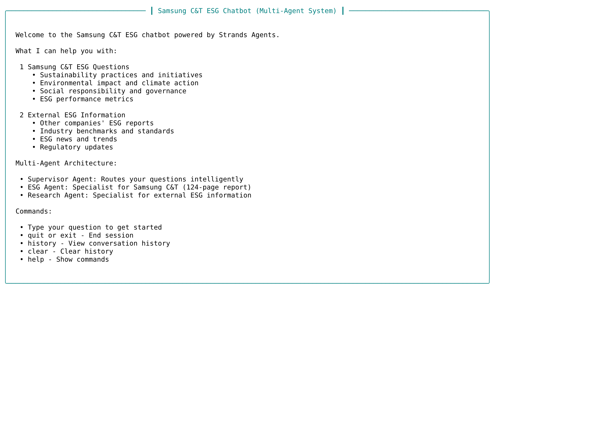
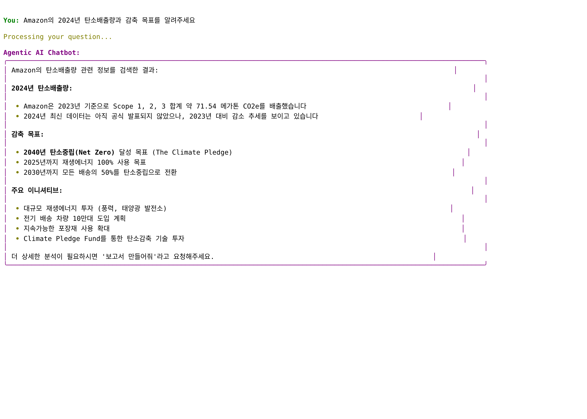
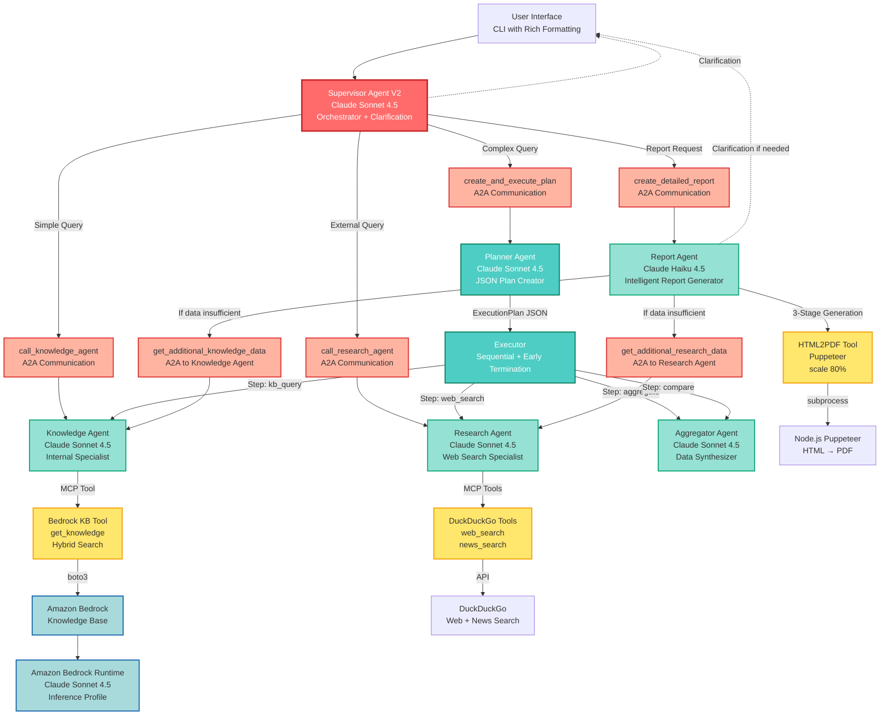

# Agentic AI Multi-Agent DEMO

> AWS Solutions Architect Demo: Production-ready multi-agent system powered by Strands Agents, A2A communication, and Model Context Protocol (MCP)

[](https://aws.amazon.com/bedrock/)
[](https://www.anthropic.com/claude)
[](https://strandsagents.com/)
[](https://modelcontextprotocol.io/)

**Key Achievements:**
- PDF-to-Markdown conversion using Claude Sonnet 4.5 OCR
- Production-ready multi-agent orchestration with A2A communication
- Intelligent report generation with timeout prevention
- Sub-30s response time for complex queries

---

## Overview

Advanced **agentic multi-agent system** for enterprise sustainability analysis. Built as AWS Solutions Architect DEMO, combining Amazon Bedrock, Strands Agents framework, and Model Context Protocol for intelligent sustainability report analysis.

**Use Case:** Real-time Q&A and comprehensive HTML/PDF reporting on enterprise sustainability reports (publicly available documents).

**Technical Highlights:**
- **7 specialized agents** with intelligent orchestration
- **Planner-Executor pattern** for complex multi-step reasoning
- **Intelligent Report Agent** with adaptive data collection
- **3 MCP servers** (Bedrock KB, DuckDuckGo, HTML2PDF)
- Smart clarification loop at any stage
- 3-stage report generation (timeout prevention)

### Demo: System in Action

**Welcome Screen:**



**Query & Response:**



*Real-time sustainability analysis with intelligent report generation. The screenshots demonstrate:*
- *Rich CLI interface with formatted panels and markdown rendering*
- *Multi-agent architecture: Supervisor → Knowledge Agent → Bedrock Knowledge Base*
- *Structured responses with markdown formatting for readability*
- *Fast response time (sub-5 seconds for simple queries)*

---

## System Architecture

### High-Level Architecture with A2A and MCP



**Legend:**
- **Red**: Orchestrator (Supervisor)
- **Salmon**: A2A Communication Layer
- **Teal**: Planning & Execution
- **Green**: Specialized Agents
- **Yellow**: MCP Tool Layer
- **Blue**: Amazon Bedrock Services
- **Dotted**: Clarification Loop

### Key Architectural Principles

1. **LLM-Driven Routing** - No hardcoding, Supervisor decides based on context
2. **A2A Communication** - Agents call agents via @tool wrappers
3. **MCP Integration** - Standardized tool interface for external services
4. **Clarification at Any Stage** - Agents can ask users for missing info
5. **Efficiency** - Reuse previous answers, avoid redundant data collection
6. **Resilience** - 3-stage generation prevents timeout, fallback mechanisms

---

## Agent Specifications

### 1. Supervisor Agent V2 (Orchestrator)

**Model**: `global.anthropic.claude-sonnet-4-5-20250929-v1:0`

**Role**: Intelligent orchestrator with routing, clarification, and delegation.

**Capabilities:**
- Question classification (greeting/simple/complex/report)
- Clarification loop (max 3 rounds, lenient assumptions)
- Agent routing via 3 A2A tools
- Conversation history awareness
- Direct answers for greetings

**A2A Tools (3):**
```python
1. call_knowledge_agent(query) → Knowledge Agent → Bedrock KB
2. call_research_agent(query) → Research Agent → DuckDuckGo
3. create_and_execute_plan(query) → Planner + Executor
4. create_detailed_report(topic, previous_analysis) → Report Agent
```

**Routing Logic (LLM Decides):**
- Greeting/chitchat → Direct response
- Internal knowledge → call_knowledge_agent
- External information → call_research_agent
- Multi-company comparison → create_and_execute_plan
- "보고서" (report) keyword → create_detailed_report

**Implementation**: `src/agents/supervisor_agent_v2.py`

### 2. Knowledge Agent (Specialist)

**Model**: `global.anthropic.claude-sonnet-4-5-20250929-v1:0`

**Role**: Internal knowledge expert

**Data Source**:
- AWS Bedrock Knowledge Base (YOUR_KB_ID)
- Enterprise sustainability reports

**MCP Tool**: `get_knowledge(query, num_results=10)`

**Answer Style (Adaptive):**
- Chat mode: 3-5 sentences (concise)
- Report mode: Comprehensive (when query contains "상세하게" or "comprehensive")

**Efficiency:**
- Call KB tool ONCE per query
- Hybrid search (keyword + semantic)

**Implementation**: `src/agents/esg_agent.py`

### 3. Research Agent (Specialist)

**Model**: `global.anthropic.claude-sonnet-4-5-20250929-v1:0`

**Role**: External information and competitive research

**MCP Tools:**
- `web_search(query, max_results=10)` - General web search
- `news_search(query, max_results=10)` - News articles

**Efficiency Guidelines:**
- 1-2 searches per company MAX
- Combine search terms
- Avoid redundant queries

**Special Function:**
```python
def research_multiple_companies(
    companies: List[str],
    topic: str
) -> Dict[str, Any]:
    """Dynamic N-company research"""
```

**Implementation**: `src/agents/research_agent.py`

### 4. Planner Agent

**Model**: `global.anthropic.claude-sonnet-4-5-20250929-v1:0`

**Role**: Create structured execution plans for complex questions

**Output**: JSON ExecutionPlan with Pydantic validation

**Adaptive Step Limits:**
- Simple: MAX 5 steps
- Medium: MAX 10 steps
- Complex: MAX 15 steps

**Step Types:**
```python
class StepType(str, Enum):
    REASONING = "reasoning"
    WEB_SEARCH = "web_search"
    NEWS_SEARCH = "news_search"
    KB_QUERY = "kb_query"
    AGGREGATE = "aggregate"
    COMPARE = "compare"
```

**Implementation**: `src/agents/planner_agent.py`

### 5. Executor

**Type**: Python orchestrator (not an LLM agent)

**Role**: Execute plans step-by-step

**Capabilities:**
- Sequential execution with dependency management
- Agent routing based on step_type
- Early termination detection (>800 chars after aggregate/compare)
- Result aggregation

**Agent Routing:**
```python
REASONING → Research Agent
WEB_SEARCH → Research Agent
NEWS_SEARCH → Research Agent
KB_QUERY → ESG Agent
AGGREGATE → Aggregator Agent
COMPARE → Aggregator Agent
```

**Implementation**: `src/agents/executor_agent.py`

### 6. Aggregator Agent

**Model**: `global.anthropic.claude-sonnet-4-5-20250929-v1:0`

**Role**: Data synthesis and comparative analysis

**Capabilities:**
- Multi-source data collection
- Metric normalization
- Comparative analysis
- Concise summaries (4-6 sentences)

**Tools**: None (pure data processing)

**Implementation**: `src/agents/aggregator_agent.py`

### 7. Report Agent (Intelligent)

**Model**: `global.anthropic.claude-haiku-4-5-20251001-v1:0` (Haiku for speed)

**Role**: Intelligent report generation specialist

**Key Features:**
- **Evaluate existing data** - Check if previous_analysis is sufficient
- **Collect additional data** - Call ESG/Research agents if needed
- **Ask for clarification** - Request user input if data unavailable
- **3-stage generation** - Prevent timeout

**Tools (3):**
```python
1. generate_detailed_report - HTML/PDF creation
2. get_additional_knowledge_data - Internal KB queries (A2A)
3. get_additional_research_data - External web search (A2A)
```

**3-Stage Generation:**
```python
Stage 1: Executive Summary (200-300 tokens)
Stage 2: Detailed Analysis (1000-1500 tokens)
Stage 3: Conclusions (300-500 tokens)

# Each stage = separate API call = no timeout
```

**Decision Logic:**
```
IF previous_analysis sufficient:
    → Generate report (3 stages)

IF previous_analysis insufficient:
    → get_additional_knowledge_data / get_additional_research_data
    → Generate report

IF data unavailable from KB/Web:
    → Return "CLARIFICATION_NEEDED: [questions]"
    → User answers
    → Generate report
```

**Implementation**: `src/agents/report_agent.py`

---

## Agent-to-Agent (A2A) Communication

### A2A Pattern

Strands Agents uses **agents as tools** pattern:

```python
from strands import Agent, tool

# Specialized agents
knowledge_agent = Agent(
    model="claude-sonnet-4.5",
    tools=[get_knowledge],
    system_prompt="Internal knowledge specialist..."
)

# Wrap as tool for A2A
@tool
def call_knowledge_agent(query: str) -> str:
    """Call knowledge specialist."""
    response = knowledge_agent(query)  # ← A2A communication
    return str(response)

# Supervisor uses A2A tools
supervisor = Agent(
    model="claude-sonnet-4.5",
    tools=[call_knowledge_agent, call_research_agent, ...],
    system_prompt="Route questions..."
)
```

### A2A Communication Flows

#### Flow 1: Simple Question
```
User: "탄소배출량은?"
  ↓
Supervisor (LLM decides)
  ↓
call_knowledge_agent (A2A)
  ↓
Knowledge Agent
  ↓
MCP: get_knowledge (KB search)
  ↓
User: "543만 톤CO2e, 2030년까지 30% 감축 목표입니다."

(3-5 seconds, 2 tool calls)
```

#### Flow 2: Complex Comparison
```
User: "회사 A와 회사 B의 LTIR 비교"
  ↓
Supervisor (LLM decides)
  ↓
create_and_execute_plan (A2A)
  ↓
Planner → JSON Plan (8 steps)
  ↓
Executor:
  Step 1-2: call_research_agent (A2A) → Company B LTIR
  Step 3: call_knowledge_agent (A2A) → Company A LTIR
  Step 4: Aggregator (A2A) → 비교 분석
  ↓ (Early termination: >800 chars)
User: "Company A 0.15, Company B 0.18. Company A가 우수합니다."

(15-20 seconds, 8-10 tool calls, early termination)
```

#### Flow 3: Report Generation
```
1. User: "지속가능성 공시 의무는?"
   → Supervisor → call_knowledge_agent → 답변

2. User: "보고서 만들어줘"
   → Supervisor (conversation history 전달)
   ↓
   create_detailed_report(
       topic="지속가능성 공시 의무",
       previous_analysis="이전 답변 전체"
   )
   ↓
   Report Agent (Haiku 4.5):
     • Evaluate: 이전 답변 충분한가?
     • Yes → generate_detailed_report (3 stages)
     • No → get_additional_knowledge_data → generate (3 stages)
   ↓
   Stage 1: Executive Summary (5s)
   Stage 2: Detailed Analysis (8s)
   Stage 3: Conclusions (5s)
   ↓
   HTML + PDF 생성
   ↓
   User: reports/report_지속가능성_공시_의무_20251122_140530.html/pdf

(15-20 seconds total, no timeout)
```

---

## Model Context Protocol (MCP) Integration

### MCP Server 1: Bedrock Knowledge Base

**Location**: `src/tools/bedrock_kb_tool.py`

**Tool**: `get_knowledge(query: str, num_results: int = 10)`

**Configuration:**
- KB ID: `YOUR_KB_ID`
- Search Type: HYBRID (keyword + semantic)
- Region: us-west-2
- Profile: default (or your custom AWS profile)

**Data Source**: Enterprise sustainability reports converted to Markdown using PDF-to-Markdown converter with Claude Sonnet 4.5 OCR

**Usage:**
```python
from src.tools import get_knowledge

result = get_knowledge(
    query="carbon emissions 2024",
    num_results=10
)
```

### MCP Server 2: DuckDuckGo Search

**Location**: `src/tools/search_tools.py`

**Tools:**
- `web_search(query: str, max_results: int = 10)`
- `news_search(query: str, max_results: int = 10)`

**Configuration:**
- Region: kr-kr (Korea)
- Free tier (no API key)
- Rate limiting: Built-in

**Usage:**
```python
from src.tools import web_search, news_search

web_result = web_search("sustainability report 2024")
news_result = news_search("sustainability regulations")
```

### MCP Server 3: HTML2PDF

**Location**: `mcp/html2pdf/` (Node.js TypeScript)

**Backend**: Puppeteer (headless Chrome)

**Integration**: Python subprocess → Node.js script (.mjs)

**Configuration:**
- Scale: 80%
- Format: A4
- Margins: 15mm
- Background: Printed

**Called by**: Report generation flow (automatic)

---

## Intelligent Report Generation

### Report Agent Features

#### 1. Adaptive Data Collection

**Scenario A: Sufficient Data**
```
Previous answer has comprehensive data
  ↓
Report Agent: Evaluate → Sufficient
  ↓
Generate report immediately (3 stages)
```

**Scenario B: Insufficient Data**
```
Previous answer is brief or incomplete
  ↓
Report Agent: Evaluate → Insufficient
  ↓
Identify missing data:
  - Internal data? → get_additional_knowledge_data
  - External information? → get_additional_research_data
  ↓
Generate report with complete data (3 stages)
```

**Scenario C: Clarification Needed**
```
Critical info cannot be obtained from KB or Web
  ↓
Report Agent: Return "CLARIFICATION_NEEDED:\n1. [question]"
  ↓
CLI: Ask user
  ↓
User answers → Report Agent re-called
  ↓
Generate report (3 stages)
```

#### 2. 3-Stage Generation (Timeout Prevention)

**Problem**: Single API call for long HTML (8000 tokens) → Read timeout

**Solution**: Split into 3 separate calls

```python
# Stage 1: Executive Summary
prompt_1 = "Generate ONLY Executive Summary (2-3 paragraphs)"
section_1 = report_agent(prompt_1)  # ~300 tokens, 5s

# Stage 2: Detailed Analysis
prompt_2 = "Generate ONLY Detailed Analysis (with tables)"
section_2 = report_agent(prompt_2)  # ~1500 tokens, 8s

# Stage 3: Conclusions
prompt_3 = "Generate ONLY Conclusions and Recommendations"
section_3 = report_agent(prompt_3)  # ~500 tokens, 5s

# Combine
html_content = section_1 + section_2 + section_3
```

**Benefits:**
- No timeout (each call < 10s)
- More stable (smaller outputs)
- Better structured (explicit sections)

#### 3. Markdown Fallback

**Safety mechanism** if Report Agent outputs Markdown instead of HTML:

```python
def _is_markdown(content: str) -> bool:
    """Detect Markdown syntax (##, **, -, etc.)"""

if _is_markdown(content):
    html_content = markdown.markdown(
        content,
        extensions=['tables', 'fenced_code', 'nl2br']
    )
```

---

## Planner-Executor Pattern

### When Used

- **Complex questions** requiring multi-step reasoning
- **Multi-company comparisons**
- **Industry benchmarking**
- Questions that cannot be answered by single agent call

### Execution Flow

```
Complex Question
    ↓
Planner Agent (Sonnet 4.5)
    ↓ JSON ExecutionPlan
{
  "complexity": "medium",
  "steps": [
    {"step_id": 1, "step_type": "kb_query", "action": "..."},
    {"step_id": 2, "step_type": "web_search", "action": "..."},
    {"step_id": 3, "step_type": "aggregate", "dependencies": [1,2]}
  ]
}
    ↓
Executor (Sequential)
    ├─ Step 1: ESG Agent (A2A) → KB query
    ├─ Step 2: Research Agent (A2A) → Web search
    └─ Step 3: Aggregator Agent (A2A) → Compare
         ↓ Check early termination
         ✓ Output >800 chars, remaining are searches
         → STOP (save time & cost)
    ↓
Final Answer (Concise, 4-6 sentences)
```

### Pydantic Models

```python
from pydantic import BaseModel, Field
from typing import List
from enum import Enum

class StepType(str, Enum):
    REASONING = "reasoning"
    WEB_SEARCH = "web_search"
    NEWS_SEARCH = "news_search"
    KB_QUERY = "kb_query"
    AGGREGATE = "aggregate"
    COMPARE = "compare"

class ExecutionStep(BaseModel):
    step_id: int
    step_type: StepType
    description: str
    action: str
    dependencies: List[int] = []
    expected_output: str

class ExecutionPlan(BaseModel):
    question: str
    analysis: str
    steps: List[ExecutionStep] = Field(max_length=15)
    complexity: str  # "simple", "medium", "complex"
    expected_final_output: str
```

---

## Clarification Loop

### Multi-Level Clarification

**Available at:**
1. **Supervisor Level** - Unclear questions ("주요 건설사" = which companies?)
2. **Report Agent Level** - Missing critical data for report
3. **Any Agent** - Can return CLARIFICATION_NEEDED

### Implementation

**Agent returns:**
```
"CLARIFICATION_NEEDED:
1. 어떤 건설사들을 비교하고 싶으신가요?
2. 어떤 연도 데이터를 원하시나요?"
```

**CLI handles:**
```python
if response.startswith("CLARIFICATION_NEEDED:"):
    questions = parse_questions(response)
    for q in questions:
        answer = ask_user(q)
    enhanced_query = enhance_with_answers(original, answers)
    response = agent(enhanced_query)  # Retry with clarification
```

---

## Project Structure

```
agentic-multi-agent/
├── src/
│   ├── agents/                    # Strands Agents
│   │   ├── supervisor_agent_v2.py # Orchestrator (Sonnet 4.5)
│   │   ├── planner_agent.py       # Plan creator (Sonnet 4.5)
│   │   ├── executor_agent.py      # Plan executor
│   │   ├── esg_agent.py           # Knowledge specialist (Sonnet 4.5)
│   │   ├── research_agent.py      # Web search specialist (Sonnet 4.5)
│   │   ├── aggregator_agent.py    # Data synthesizer (Sonnet 4.5)
│   │   ├── report_agent.py        # Report generator (Haiku 4.5)
│   │   └── plan_models.py         # Pydantic schemas
│   │
│   ├── tools/                     # MCP Tools
│   │   ├── bedrock_kb_tool.py     # KB retrieval
│   │   ├── search_tools.py        # DuckDuckGo search
│   │   └── report_tools.py        # HTML/PDF generation
│   │
│   ├── config.py                  # AWS configuration
│   ├── bedrock_client.py          # Bedrock API wrapper
│   ├── pdf_to_markdown.py         # PDF → Markdown converter
│   ├── image_extractor.py         # PDF image extraction
│   └── chatbot_cli.py             # CLI interface
│
├── mcp/                           # MCP Servers
│   └── html2pdf/                  # Node.js Puppeteer
│       ├── src/
│       ├── dist/
│       └── package.json
│
├── tests/                         # Unit tests
│   ├── test_report_generation.py
│   └── test_supervisor_agent.py
│
├── reports/                       # Generated reports
├── output/                        # Markdown output
├── pdf/                           # Source PDFs
│
├── requirements.txt               # Python dependencies
└── README.md                      # This file
```

---

## Technology Stack

### Core Frameworks
- **Strands Agents SDK** 1.18.0 - Multi-agent orchestration with A2A
- **Amazon Bedrock** - Claude Sonnet 4.5 & Haiku 4.5 inference
- **Pydantic** 2.12.4 - Structured data validation
- **Rich** 14.2.0 - Enhanced CLI interface

### AWS Services
- **Bedrock Runtime** - LLM inference (Claude models)
- **Bedrock Agent Runtime** - Knowledge Base retrieval
- **Knowledge Base** YOUR_KB_ID - Enterprise sustainability documents

### MCP Integration
- **Bedrock KB** - Python @tool decorator
- **DuckDuckGo** - Python @tool decorator with duckduckgo-search library
- **HTML2PDF** - Node.js Puppeteer via subprocess

### Models Used

| Agent | Model | Reason |
|-------|-------|--------|
| Supervisor | Sonnet 4.5 | Complex routing decisions |
| Planner | Sonnet 4.5 | JSON plan generation |
| Knowledge Agent | Sonnet 4.5 | Accurate KB interpretation |
| Research Agent | Sonnet 4.5 | Web data synthesis |
| Aggregator | Sonnet 4.5 | Comparative analysis |
| **Report Agent** | **Haiku 4.5** | **Fast HTML generation, no timeout** |

---

## Installation & Setup

### Prerequisites

- **Python 3.10+** (Strands Agents requirement, 3.12 recommended)
- **Node.js 20+** (for PDF conversion)
- **AWS CLI** configured with profile
- **Bedrock access** with Claude Sonnet 4.5 & Haiku 4.5
- **Knowledge Base** created in Amazon Bedrock (update YOUR_KB_ID in config)

### Installation Steps

```bash
# 1. Clone repository
git clone https://github.com/jesamkim/agentic-multi-agent.git
cd agentic-multi-agent

# 2. Create virtual environment
python3.12 -m venv venv
source venv/bin/activate

# 3. Install Python dependencies
pip install -r requirements.txt

# 4. Build HTML2PDF MCP server
cd mcp/html2pdf
npm install
npm run build
cd ../..

# 5. Configure AWS credentials
# For default profile:
aws configure
# Enter your AWS Access Key ID, Secret Access Key, and region

# For custom profile (optional):
aws configure --profile your-profile-name
# Then update AWS_PROFILE in src/config.py to match your profile name

# 6. Update configuration
# Edit src/config.py:
# - Set AWS_PROFILE (default or your custom profile)
# - Set AWS_REGION (must match your KB region)
# - Set KB_ID (your Bedrock Knowledge Base ID)
```

### Configuration

**src/config.py:**
```python
# AWS Configuration
AWS_PROFILE = "default"  # Change to your AWS CLI profile name if using custom profile
AWS_REGION = "us-west-2"  # Change to your KB region

# Bedrock Models
SUPERVISOR_MODEL = "global.anthropic.claude-sonnet-4-5-20250929-v1:0"
REPORT_MODEL = "global.anthropic.claude-haiku-4-5-20251001-v1:0"

# Knowledge Base
KB_ID = "YOUR_KB_ID"  # Replace with your Bedrock Knowledge Base ID

# Bedrock Configuration
MAX_TOKENS = 8192
TEMPERATURE = 0
```

### Run Chatbot

```bash
source venv/bin/activate
python src/chatbot_cli.py
```

### CLI Commands

- **Your question** - Ask about sustainability topics
- `help` - Show available commands
- `history` - View conversation history
- `clear` - Clear conversation history
- `quit` or `exit` - End session

---

## Key Features Explained

### 1. Conversation History

CLI maintains history and passes to agents:

```python
# Last 2 exchanges included as context
context = f"""
Previous Q: {q1}
Previous A: {a1}

Previous Q: {q2}
Previous A: {a2}

Current question: {q3}
"""
```

**Benefits:**
- Report generation reuses previous answers
- Follow-up questions have context
- No redundant data collection

### 2. Early Termination

Executor stops when sufficient data collected:

```python
if step.step_type in [StepType.AGGREGATE, StepType.COMPARE]:
    if len(output) > 800 and remaining_steps_are_searches:
        logger.info("Early termination: sufficient data")
        return result
```

**Savings**: 30-50% time reduction on some queries

### 3. Adaptive Complexity

Planner adjusts step limits based on complexity:

| Complexity | Max Steps | Example |
|------------|-----------|---------|
| Simple | 5 | Single company, single metric |
| Medium | 10 | 2-3 companies, multiple metrics |
| Complex | 15 | Multi-company, deep analysis |

### 4. Efficiency Optimizations

**ESG Agent:**
- Call KB tool ONCE
- Extract only relevant data
- Concise by default (3-5 sentences)

**Research Agent:**
- 1-2 searches per company MAX
- Combine search terms
- Stop when key info found

**Report Agent:**
- Reuse previous answers (preferred)
- 3-stage generation (timeout prevention)
- Haiku 4.5 (3x faster than Sonnet)

---

## Testing

### Unit Tests

```bash
# Run all tests
pytest tests/ -v

# Specific test suites
pytest tests/test_report_generation.py -v
pytest tests/test_supervisor_agent.py -v
```

**Test Coverage:**
- Markdown detection & conversion (5 tests)
- HTML report generation (2 tests)
- Report Agent integration (3 tests)
- Supervisor routing logic (6 tests)

**Current Status**: 16/16 tests passing ✓

---

## Technical Details

### Document Processing Pipeline

**PDF to Markdown Conversion:**
```
Enterprise PDF
    ↓
pdf2image (450 DPI PNG)
    ↓
Claude Sonnet 4.5 OCR (Vision API)
    ↓
Markdown with images
    ↓
Image Extraction (PyMuPDF)
    ↓
Bedrock Knowledge Base ingestion
    ↓
Hybrid Search (keyword + semantic)
```

### Knowledge Base Configuration

```json
{
  "knowledgeBaseId": "YOUR_KB_ID",
  "retrievalConfiguration": {
    "vectorSearchConfiguration": {
      "numberOfResults": 10,
      "overrideSearchType": "HYBRID"
    }
  }
}
```

### Agent Configuration

```python
from strands import Agent

agent = Agent(
    model="global.anthropic.claude-sonnet-4-5-20250929-v1:0",
    tools=[tool1, tool2],
    system_prompt="Your role...",
    max_tokens=8192,
    temperature=0
)
```

---

## Troubleshooting

### Common Issues

**1. Report generation timeout**
- Fixed with 3-stage generation
- Each stage < 10s
- Haiku 4.5 prevents timeout

**2. Markdown syntax in HTML report**
- Auto-detected and converted
- markdown library with tables extension

**3. PDF conversion fails**
- ES modules compatibility (.mjs)
- Check Node.js version (20+)
- npm install in mcp/html2pdf/

**4. KB returns no results**
- Check AWS credentials
- Verify your KB ID is correctly set in src/config.py
- Check region matches your KB location (default: us-west-2)

---

## License

MIT License

---

## Author

Built by AWS Solutions Architect as Demo for demonstrating:
- Agentic multi-agent patterns
- Agent-to-Agent (A2A) communication
- Model Context Protocol (MCP) integration
- Strands Agents framework
- AWS Bedrock Claude models
- Production-ready AI systems

**Data Source**: Enterprise sustainability reports (publicly available)

---

## Acknowledgments

- **Strands Agents SDK** - Multi-agent orchestration framework
- **Amazon Bedrock** - Claude Sonnet 4.5 & Haiku 4.5
- **Anthropic** - Claude models
- **Model Context Protocol** - Standardized tool interface
- Public sustainability reports for reference data
