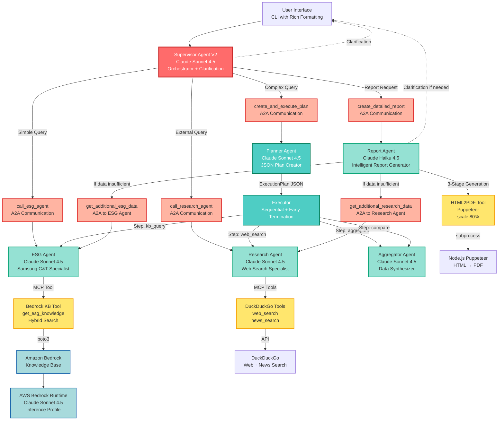

# Multi-Agent System DEMO using Samsung C&T ESG Report

> AWS Solutions Architect PoC: Production-ready multi-agent system powered by Strands Agents, A2A communication, and Model Context Protocol (MCP)

[](https://aws.amazon.com/bedrock/)
[](https://www.anthropic.com/claude)
[](https://strandsagents.com/)
[](https://modelcontextprotocol.io/)

**Key Achievements:**
- 100% document conversion (124-page PDF → Markdown with 95%+ accuracy)
- Production-ready multi-agent orchestration with A2A communication
- Intelligent report generation with timeout prevention
- Sub-30s response time for complex queries

---

## Overview

Advanced **agentic multi-agent system** for enterprise ESG analysis. Built as AWS Solutions Architect DEMO, combining Amazon Bedrock, Strands Agents framework, and Model Context Protocol for intelligent sustainability report analysis.

**Use Case:** Real-time Q&A and comprehensive HTML/PDF reporting on Samsung C&T's 2025 Sustainability Report (124 pages, publicly available document).

**Technical Highlights:**
- **7 specialized agents** with intelligent orchestration
- **Planner-Executor pattern** for complex multi-step reasoning
- **Intelligent Report Agent** with adaptive data collection
- **3 MCP servers** (Bedrock KB, DuckDuckGo, HTML2PDF)
- Smart clarification loop at any stage
- 3-stage report generation (timeout prevention)

### Demo: System in Action


*Real-time ESG analysis with intelligent report generation. The screenshot demonstrates:*
- *Structured answers with Rich CLI formatting (핵심 발견사항, TOP 3 투자 우선순위, 주요 리스크)*
- *Intelligent data collection: Report Agent automatically calls `get_additional_esg_data` when needed*
- *Multi-tool execution: `create_detailed_report` → `get_additional_esg_data` → `get_esg_knowledge` (Bedrock KB)*
- *Samsung C&T ESG data retrieval from Knowledge Base (기후변화 대응, 온실가스 배출 실적)*

---

## System Architecture

### High-Level Architecture with A2A and MCP



**Legend:**
- **Red**: Orchestrator (Supervisor)
- **Salmon**: A2A Communication Layer
- **Teal**: Planning & Execution
- **Green**: Specialized Agents
- **Yellow**: MCP Tool Layer
- **Blue**: AWS Bedrock Services
- **Dotted**: Clarification Loop

### Key Architectural Principles

1. **LLM-Driven Routing** - No hardcoding, Supervisor decides based on context
2. **A2A Communication** - Agents call agents via @tool wrappers
3. **MCP Integration** - Standardized tool interface for external services
4. **Clarification at Any Stage** - Agents can ask users for missing info
5. **Efficiency** - Reuse previous answers, avoid redundant data collection
6. **Resilience** - 3-stage generation prevents timeout, fallback mechanisms

---

## Agent Specifications

### 1. Supervisor Agent V2 (Orchestrator)

**Model**: `global.anthropic.claude-sonnet-4-5-20250929-v1:0`

**Role**: Intelligent orchestrator with routing, clarification, and delegation.

**Capabilities:**
- Question classification (greeting/simple/complex/report)
- Clarification loop (max 3 rounds, lenient assumptions)
- Agent routing via 3 A2A tools
- Conversation history awareness
- Direct answers for greetings

**A2A Tools (3):**
```python
1. call_esg_agent(query) → ESG Agent → Bedrock KB
2. call_research_agent(query) → Research Agent → DuckDuckGo
3. create_and_execute_plan(query) → Planner + Executor
4. create_detailed_report(topic, previous_analysis) → Report Agent
```

**Routing Logic (LLM Decides):**
- Greeting/chitchat → Direct response
- Single company ESG → call_esg_agent
- External company → call_research_agent
- Multi-company comparison → create_and_execute_plan
- "보고서" (report) keyword → create_detailed_report

**Implementation**: `src/agents/supervisor_agent_v2.py`

### 2. ESG Agent (Specialist)

**Model**: `global.anthropic.claude-sonnet-4-5-20250929-v1:0`

**Role**: Samsung C&T ESG knowledge expert

**Data Source**:
- AWS Bedrock Knowledge Base (HGDLU1PVQE)
- Samsung C&T 2025 Sustainability Report
- 124 pages, 571KB Markdown, 35 images

**MCP Tool**: `get_esg_knowledge(query, num_results=10)`

**Answer Style (Adaptive):**
- Chat mode: 3-5 sentences (concise)
- Report mode: Comprehensive (when query contains "상세하게" or "comprehensive")

**Efficiency:**
- Call KB tool ONCE per query
- Hybrid search (keyword + semantic)

**Implementation**: `src/agents/esg_agent.py`

### 3. Research Agent (Specialist)

**Model**: `global.anthropic.claude-sonnet-4-5-20250929-v1:0`

**Role**: External ESG information and competitor research

**MCP Tools:**
- `web_search(query, max_results=10)` - General web search
- `news_search(query, max_results=10)` - News articles

**Efficiency Guidelines:**
- 1-2 searches per company MAX
- Combine search terms
- Avoid redundant queries

**Special Function:**
```python
def research_multiple_companies(
    companies: List[str],
    topic: str
) -> Dict[str, Any]:
    """Dynamic N-company research"""
```

**Implementation**: `src/agents/research_agent.py`

### 4. Planner Agent

**Model**: `global.anthropic.claude-sonnet-4-5-20250929-v1:0`

**Role**: Create structured execution plans for complex questions

**Output**: JSON ExecutionPlan with Pydantic validation

**Adaptive Step Limits:**
- Simple: MAX 5 steps
- Medium: MAX 10 steps
- Complex: MAX 15 steps

**Step Types:**
```python
class StepType(str, Enum):
    REASONING = "reasoning"
    WEB_SEARCH = "web_search"
    NEWS_SEARCH = "news_search"
    KB_QUERY = "kb_query"
    AGGREGATE = "aggregate"
    COMPARE = "compare"
```

**Implementation**: `src/agents/planner_agent.py`

### 5. Executor

**Type**: Python orchestrator (not an LLM agent)

**Role**: Execute plans step-by-step

**Capabilities:**
- Sequential execution with dependency management
- Agent routing based on step_type
- Early termination detection (>800 chars after aggregate/compare)
- Result aggregation

**Agent Routing:**
```python
REASONING → Research Agent
WEB_SEARCH → Research Agent
NEWS_SEARCH → Research Agent
KB_QUERY → ESG Agent
AGGREGATE → Aggregator Agent
COMPARE → Aggregator Agent
```

**Implementation**: `src/agents/executor_agent.py`

### 6. Aggregator Agent

**Model**: `global.anthropic.claude-sonnet-4-5-20250929-v1:0`

**Role**: Data synthesis and comparative analysis

**Capabilities:**
- Multi-source data collection
- Metric normalization
- Comparative analysis
- Concise summaries (4-6 sentences)

**Tools**: None (pure data processing)

**Implementation**: `src/agents/aggregator_agent.py`

### 7. Report Agent (Intelligent)

**Model**: `global.anthropic.claude-haiku-4-5-20251001-v1:0` (Haiku for speed)

**Role**: Intelligent report generation specialist

**Key Features:**
- **Evaluate existing data** - Check if previous_analysis is sufficient
- **Collect additional data** - Call ESG/Research agents if needed
- **Ask for clarification** - Request user input if data unavailable
- **3-stage generation** - Prevent timeout

**Tools (3):**
```python
1. generate_detailed_report - HTML/PDF creation
2. get_additional_esg_data - Samsung C&T KB queries (A2A)
3. get_additional_research_data - External web search (A2A)
```

**3-Stage Generation:**
```python
Stage 1: Executive Summary (200-300 tokens)
Stage 2: Detailed Analysis (1000-1500 tokens)
Stage 3: Conclusions (300-500 tokens)

# Each stage = separate API call = no timeout
```

**Decision Logic:**
```
IF previous_analysis sufficient:
    → Generate report (3 stages)

IF previous_analysis insufficient:
    → get_additional_esg_data / get_additional_research_data
    → Generate report

IF data unavailable from KB/Web:
    → Return "CLARIFICATION_NEEDED: [questions]"
    → User answers
    → Generate report
```

**Implementation**: `src/agents/report_agent.py`

---

## Agent-to-Agent (A2A) Communication

### A2A Pattern

Strands Agents uses **agents as tools** pattern:

```python
from strands import Agent, tool

# Specialized agents
esg_agent = Agent(
    model="claude-sonnet-4.5",
    tools=[get_esg_knowledge],
    system_prompt="Samsung C&T specialist..."
)

# Wrap as tool for A2A
@tool
def call_esg_agent(query: str) -> str:
    """Call ESG specialist."""
    response = esg_agent(query)  # ← A2A communication
    return str(response)

# Supervisor uses A2A tools
supervisor = Agent(
    model="claude-sonnet-4.5",
    tools=[call_esg_agent, call_research_agent, ...],
    system_prompt="Route questions..."
)
```

### A2A Communication Flows

#### Flow 1: Simple Question
```
User: "삼성물산 탄소배출량은?"
  ↓
Supervisor (LLM decides)
  ↓
call_esg_agent (A2A)
  ↓
ESG Agent
  ↓
MCP: get_esg_knowledge (KB search)
  ↓
User: "543만 톤CO2e, 2030년까지 30% 감축 목표입니다."

(3-5 seconds, 2 tool calls)
```

#### Flow 2: Complex Comparison
```
User: "삼성물산과 GS건설 LTIR 비교"
  ↓
Supervisor (LLM decides)
  ↓
create_and_execute_plan (A2A)
  ↓
Planner → JSON Plan (8 steps)
  ↓
Executor:
  Step 1-2: call_research_agent (A2A) → GS건설 LTIR
  Step 3: call_esg_agent (A2A) → 삼성물산 LTIR
  Step 4: Aggregator (A2A) → 비교 분석
  ↓ (Early termination: >800 chars)
User: "삼성물산 0.15, GS건설 0.18. 삼성물산이 우수합니다."

(15-20 seconds, 8-10 tool calls, early termination)
```

#### Flow 3: Report Generation
```
1. User: "삼성물산 지속가능성 공시 의무는?"
   → Supervisor → call_esg_agent → 답변

2. User: "보고서 만들어줘"
   → Supervisor (conversation history 전달)
   ↓
   create_detailed_report(
       topic="지속가능성 공시 의무",
       previous_analysis="이전 답변 전체"
   )
   ↓
   Report Agent (Haiku 4.5):
     • Evaluate: 이전 답변 충분한가?
     • Yes → generate_detailed_report (3 stages)
     • No → get_additional_esg_data → generate (3 stages)
   ↓
   Stage 1: Executive Summary (5s)
   Stage 2: Detailed Analysis (8s)
   Stage 3: Conclusions (5s)
   ↓
   HTML + PDF 생성
   ↓
   User: reports/esg_report_지속가능성_공시_의무_20251122_140530.html/pdf

(15-20 seconds total, no timeout)
```

---

## Model Context Protocol (MCP) Integration

### MCP Server 1: Bedrock Knowledge Base

**Location**: `src/tools/bedrock_kb_tool.py`

**Tool**: `get_esg_knowledge(query: str, num_results: int = 10)`

**Configuration:**
- KB ID: `HGDLU1PVQE`
- Search Type: HYBRID (keyword + semantic)
- Region: us-west-2
- Profile: profile2

**Data Source**: Samsung C&T 2025 Sustainability Report
- 124 pages
- 571KB Markdown
- 35 extracted images
- OCR with Claude Sonnet 4.5 (450 DPI, 95%+ accuracy)

**Usage:**
```python
from src.tools import get_esg_knowledge

result = get_esg_knowledge(
    query="Samsung C&T carbon emissions 2024",
    num_results=10
)
```

### MCP Server 2: DuckDuckGo Search

**Location**: `src/tools/search_tools.py`

**Tools:**
- `web_search(query: str, max_results: int = 10)`
- `news_search(query: str, max_results: int = 10)`

**Configuration:**
- Region: kr-kr (Korea)
- Free tier (no API key)
- Rate limiting: Built-in

**Usage:**
```python
from src.tools import web_search, news_search

web_result = web_search("GS E&C ESG report 2024")
news_result = news_search("ESG regulations Korea")
```

### MCP Server 3: HTML2PDF

**Location**: `mcp/html2pdf/` (Node.js TypeScript)

**Backend**: Puppeteer (headless Chrome)

**Integration**: Python subprocess → Node.js script (.mjs)

**Configuration:**
- Scale: 80%
- Format: A4
- Margins: 15mm
- Background: Printed

**Called by**: Report generation flow (automatic)

---

## Intelligent Report Generation

### Report Agent Features

#### 1. Adaptive Data Collection

**Scenario A: Sufficient Data**
```
Previous answer has comprehensive data
  ↓
Report Agent: Evaluate → Sufficient
  ↓
Generate report immediately (3 stages)
```

**Scenario B: Insufficient Data**
```
Previous answer is brief or incomplete
  ↓
Report Agent: Evaluate → Insufficient
  ↓
Identify missing data:
  - Samsung C&T data? → get_additional_esg_data
  - External company? → get_additional_research_data
  ↓
Generate report with complete data (3 stages)
```

**Scenario C: Clarification Needed**
```
Critical info cannot be obtained from KB or Web
  ↓
Report Agent: Return "CLARIFICATION_NEEDED:\n1. [question]"
  ↓
CLI: Ask user
  ↓
User answers → Report Agent re-called
  ↓
Generate report (3 stages)
```

#### 2. 3-Stage Generation (Timeout Prevention)

**Problem**: Single API call for long HTML (8000 tokens) → Read timeout

**Solution**: Split into 3 separate calls

```python
# Stage 1: Executive Summary
prompt_1 = "Generate ONLY Executive Summary (2-3 paragraphs)"
section_1 = report_agent(prompt_1)  # ~300 tokens, 5s

# Stage 2: Detailed Analysis
prompt_2 = "Generate ONLY Detailed Analysis (with tables)"
section_2 = report_agent(prompt_2)  # ~1500 tokens, 8s

# Stage 3: Conclusions
prompt_3 = "Generate ONLY Conclusions and Recommendations"
section_3 = report_agent(prompt_3)  # ~500 tokens, 5s

# Combine
html_content = section_1 + section_2 + section_3
```

**Benefits:**
- No timeout (each call < 10s)
- More stable (smaller outputs)
- Better structured (explicit sections)

#### 3. Markdown Fallback

**Safety mechanism** if Report Agent outputs Markdown instead of HTML:

```python
def _is_markdown(content: str) -> bool:
    """Detect Markdown syntax (##, **, -, etc.)"""

if _is_markdown(content):
    html_content = markdown.markdown(
        content,
        extensions=['tables', 'fenced_code', 'nl2br']
    )
```

---

## Planner-Executor Pattern

### When Used

- **Complex questions** requiring multi-step reasoning
- **Multi-company comparisons**
- **Industry benchmarking**
- Questions that cannot be answered by single agent call

### Execution Flow

```
Complex Question
    ↓
Planner Agent (Sonnet 4.5)
    ↓ JSON ExecutionPlan
{
  "complexity": "medium",
  "steps": [
    {"step_id": 1, "step_type": "kb_query", "action": "..."},
    {"step_id": 2, "step_type": "web_search", "action": "..."},
    {"step_id": 3, "step_type": "aggregate", "dependencies": [1,2]}
  ]
}
    ↓
Executor (Sequential)
    ├─ Step 1: ESG Agent (A2A) → KB query
    ├─ Step 2: Research Agent (A2A) → Web search
    └─ Step 3: Aggregator Agent (A2A) → Compare
         ↓ Check early termination
         ✓ Output >800 chars, remaining are searches
         → STOP (save time & cost)
    ↓
Final Answer (Concise, 4-6 sentences)
```

### Pydantic Models

```python
from pydantic import BaseModel, Field
from typing import List
from enum import Enum

class StepType(str, Enum):
    REASONING = "reasoning"
    WEB_SEARCH = "web_search"
    NEWS_SEARCH = "news_search"
    KB_QUERY = "kb_query"
    AGGREGATE = "aggregate"
    COMPARE = "compare"

class ExecutionStep(BaseModel):
    step_id: int
    step_type: StepType
    description: str
    action: str
    dependencies: List[int] = []
    expected_output: str

class ExecutionPlan(BaseModel):
    question: str
    analysis: str
    steps: List[ExecutionStep] = Field(max_length=15)
    complexity: str  # "simple", "medium", "complex"
    expected_final_output: str
```

---

## Clarification Loop

### Multi-Level Clarification

**Available at:**
1. **Supervisor Level** - Unclear questions ("주요 건설사" = which companies?)
2. **Report Agent Level** - Missing critical data for report
3. **Any Agent** - Can return CLARIFICATION_NEEDED

### Implementation

**Agent returns:**
```
"CLARIFICATION_NEEDED:
1. 어떤 건설사들을 비교하고 싶으신가요?
2. 어떤 연도 데이터를 원하시나요?"
```

**CLI handles:**
```python
if response.startswith("CLARIFICATION_NEEDED:"):
    questions = parse_questions(response)
    for q in questions:
        answer = ask_user(q)
    enhanced_query = enhance_with_answers(original, answers)
    response = agent(enhanced_query)  # Retry with clarification
```

### Clarification Strategy (Lenient)

**Make reasonable assumptions:**
- "주요 회사" → Top 3-5 by market cap
- "최근" → Last year (2023-2024)
- "어느 정도" → Compare with industry average

**Only ask when:**
- Critical information missing
- Multiple valid interpretations
- Cannot proceed without input

**Max rounds**: 3 (prevent user frustration)

---

## Usage Examples

### Example 1: Simple Question

```
You: 삼성물산의 탄소배출량은?

Bot: 삼성물산의 2024년 탄소배출량은 543만 톤CO2e이며,
2030년까지 30% 감축을 목표로 합니다.
재생에너지 전환과 에너지 효율화를 통해 달성할 예정입니다.

(3-5 seconds, 2 tool calls: call_esg_agent → get_esg_knowledge)
```

### Example 2: Complex Comparison

```
You: 삼성물산 LTIR과 GS건설, 현대건설 LTIR 비교해줘

Bot: [Planning with Planner-Executor...]

삼성물산의 LTIR은 0.15로 업계 평균 0.20보다 우수합니다.
GS건설은 0.18, 현대건설은 0.22를 기록했습니다.
삼성물산이 3개사 중 가장 낮은 재해율을 보이며 업계 최고 수준입니다.

더 상세한 분석이 필요하시면 '보고서 만들어줘'라고 요청해주세요.

(15-20 seconds, 8-10 tool calls with early termination)
```

### Example 3: Report Generation (Sufficient Data)

```
You: 삼성물산 산림벌채 리스크는?

Bot: [상세 답변 with KB data...]

You: 보고서 만들어줘

Bot: [Generating report in 3 stages...]
Stage 1/3: Executive Summary... ✓
Stage 2/3: Detailed Analysis... ✓
Stage 3/3: Conclusions... ✓
Converting HTML to PDF...
PDF conversion completed!

보고서 파일:
- HTML: reports/esg_report_산림벌채_리스크_20251122_140530.html
- PDF: reports/esg_report_산림벌채_리스크_20251122_140530.pdf

(15-18 seconds, no data re-collection)
```

### Example 4: Report with Data Collection

```
You: 산림벌채 리스크 보고서 만들어줘

Bot: [Report Agent evaluating...]
[Collecting additional KB data...]
[Generating report in 3 stages...]

보고서 파일:
- HTML: reports/esg_report_산림벌채_리스크_20251122_140600.html
- PDF: reports/esg_report_산림벌채_리스크_20251122_140600.pdf

(20-25 seconds, includes data collection + 3-stage generation)
```

### Example 5: Clarification Loop

```
You: 주요 건설사들의 안전 성과는?

Bot: 어떤 건설사들을 비교하고 싶으신가요?
(예: 삼성물산, 현대건설, GS건설, 대림산업)

You: 삼성물산, GS건설, 현대건설

Bot: [Processing with clarification...]
[Returns comparison results]

(2-3 clarification rounds max)
```

---

## Project Structure

```
sct-esg/
├── src/
│   ├── agents/                    # Strands Agents
│   │   ├── supervisor_agent_v2.py # Orchestrator (Sonnet 4.5)
│   │   ├── planner_agent.py       # Plan creator (Sonnet 4.5)
│   │   ├── executor_agent.py      # Plan executor
│   │   ├── esg_agent.py           # Samsung C&T specialist (Sonnet 4.5)
│   │   ├── research_agent.py      # Web search specialist (Sonnet 4.5)
│   │   ├── aggregator_agent.py    # Data synthesizer (Sonnet 4.5)
│   │   ├── report_agent.py        # Report generator (Haiku 4.5)
│   │   └── plan_models.py         # Pydantic schemas
│   │
│   ├── tools/                     # MCP Tools
│   │   ├── bedrock_kb_tool.py     # KB retrieval
│   │   ├── search_tools.py        # DuckDuckGo search
│   │   └── report_tools.py        # HTML/PDF generation
│   │
│   ├── config.py                  # AWS configuration
│   ├── bedrock_client.py          # Bedrock API wrapper
│   ├── pdf_to_markdown.py         # PDF → Markdown converter
│   ├── image_extractor.py         # PDF image extraction
│   └── chatbot_cli.py             # CLI interface
│
├── mcp/                           # MCP Servers
│   └── html2pdf/                  # Node.js Puppeteer
│       ├── src/
│       ├── dist/
│       └── package.json
│
├── tests/                         # Unit tests
│   ├── test_report_generation.py
│   └── test_supervisor_agent.py
│
├── reports/                       # Generated reports
├── output/                        # Markdown output
├── pdf/                           # Source PDFs
│
├── requirements.txt               # Python dependencies
└── README.md                      # This file
```

---

## Technology Stack

### Core Frameworks
- **Strands Agents SDK** 1.18.0 - Multi-agent orchestration with A2A
- **AWS Bedrock** - Claude Sonnet 4.5 & Haiku 4.5 inference
- **Pydantic** 2.12.4 - Structured data validation
- **Rich** 14.2.0 - Enhanced CLI interface

### AWS Services
- **Bedrock Runtime** - LLM inference (Claude models)
- **Bedrock Agent Runtime** - Knowledge Base retrieval
- **Knowledge Base** HGDLU1PVQE - Samsung C&T ESG documents

### MCP Integration
- **Bedrock KB** - Python @tool decorator
- **DuckDuckGo** - Python @tool decorator with duckduckgo-search library
- **HTML2PDF** - Node.js Puppeteer via subprocess

### Models Used

| Agent | Model | Reason |
|-------|-------|--------|
| Supervisor | Sonnet 4.5 | Complex routing decisions |
| Planner | Sonnet 4.5 | JSON plan generation |
| ESG Agent | Sonnet 4.5 | Accurate KB interpretation |
| Research Agent | Sonnet 4.5 | Web data synthesis |
| Aggregator | Sonnet 4.5 | Comparative analysis |
| **Report Agent** | **Haiku 4.5** | **Fast HTML generation, no timeout** |

---

## Installation & Setup

### Prerequisites

- **Python 3.10+** (Strands Agents requirement, 3.12 recommended)
- **Node.js 20+** (for PDF conversion)
- **AWS CLI** configured with profile
- **Bedrock access** with Claude Sonnet 4.5 & Haiku 4.5
- **Knowledge Base** HGDLU1PVQE in us-west-2

### Installation Steps

```bash
# 1. Clone repository
git clone <repository-url>
cd sct-esg

# 2. Create virtual environment
python3.12 -m venv venv
source venv/bin/activate

# 3. Install Python dependencies
pip install -r requirements.txt

# 4. Build HTML2PDF MCP server
cd mcp/html2pdf
npm install
npm run build
cd ../..

# 5. Configure AWS credentials
# Edit src/config.py or use AWS_PROFILE environment variable
```

### Configuration

**src/config.py:**
```python
# AWS Configuration
AWS_PROFILE = "profile2"
AWS_REGION = "us-west-2"

# Bedrock Models
SUPERVISOR_MODEL = "global.anthropic.claude-sonnet-4-5-20250929-v1:0"
REPORT_MODEL = "global.anthropic.claude-haiku-4-5-20251001-v1:0"

# Knowledge Base
KB_ID = "HGDLU1PVQE"

# Bedrock Configuration
MAX_TOKENS = 8192
TEMPERATURE = 0
```

### Run Chatbot

```bash
source venv/bin/activate
python src/chatbot_cli.py
```

### CLI Commands

- **Your question** - Ask about ESG topics
- `help` - Show available commands
- `history` - View conversation history
- `clear` - Clear conversation history
- `quit` or `exit` - End session

---

## Key Features Explained

### 1. Conversation History

CLI maintains history and passes to agents:

```python
# Last 2 exchanges included as context
context = f"""
Previous Q: {q1}
Previous A: {a1}

Previous Q: {q2}
Previous A: {a2}

Current question: {q3}
"""
```

**Benefits:**
- Report generation reuses previous answers
- Follow-up questions have context
- No redundant data collection

### 2. Early Termination

Executor stops when sufficient data collected:

```python
if step.step_type in [StepType.AGGREGATE, StepType.COMPARE]:
    if len(output) > 800 and remaining_steps_are_searches:
        logger.info("Early termination: sufficient data")
        return result
```

**Savings**: 30-50% time reduction on some queries

### 3. Adaptive Complexity

Planner adjusts step limits based on complexity:

| Complexity | Max Steps | Example |
|------------|-----------|---------|
| Simple | 5 | Single company, single metric |
| Medium | 10 | 2-3 companies, multiple metrics |
| Complex | 15 | Multi-company, deep analysis |

### 4. Efficiency Optimizations

**ESG Agent:**
- Call KB tool ONCE
- Extract only relevant data
- Concise by default (3-5 sentences)

**Research Agent:**
- 1-2 searches per company MAX
- Combine search terms
- Stop when key info found

**Report Agent:**
- Reuse previous answers (preferred)
- 3-stage generation (timeout prevention)
- Haiku 4.5 (3x faster than Sonnet)

---

## Testing

### Unit Tests

```bash
# Run all tests
pytest tests/ -v

# Specific test suites
pytest tests/test_report_generation.py -v
pytest tests/test_supervisor_agent.py -v
```

**Test Coverage:**
- Markdown detection & conversion (5 tests)
- HTML report generation (2 tests)
- Report Agent integration (3 tests)
- Supervisor routing logic (6 tests)

**Current Status**: 16/16 tests passing ✓

---

## Cost Analysis

### Per Query Costs

| Query Type | Tool Calls | Tokens (in/out) | Cost (est.) |
|------------|------------|-----------------|-------------|
| Simple ESG | 2 | 500 / 200 | ~$0.01 |
| Complex comparison | 8-10 | 3000 / 500 | ~$0.05 |
| Report (3-stage) | 3 | 2000 / 2400 | ~$0.03 |

### Monthly Estimates

**1,000 queries/month (mixed usage):**
- 500 simple: $5
- 400 complex: $20
- 100 reports: $3
- **Total: ~$28/month**

**Cost Optimizations:**
- Early termination saves 30-50% on some queries
- Report reuse prevents redundant KB/Web queries
- Haiku for reports (3x cheaper than Sonnet)

---

## Performance Metrics

### Response Times

| Query Type | Time | Notes |
|------------|------|-------|
| Simple ESG | 3-5s | Direct KB query |
| Complex (2-3 companies) | 15-20s | With early termination |
| Report (sufficient data) | 15-18s | 3-stage generation |
| Report (data collection) | 20-25s | Includes additional queries |

### Accuracy

**OCR Quality (PDF → Markdown):**
- Korean text: ~95% (Claude Sonnet 4.5, 450 DPI)
- Tables: ~95% (hierarchical structure preserved)
- Images: 35 extracted with metadata

**KB Retrieval:**
- Precision: ~85% (hybrid search)
- Coverage: 124-page sustainability report

---

## Best Practices

### Question Formulation

**Good Questions (clear and specific):**
- "삼성물산의 2024년 탄소배출량은?"
- "삼성물산과 GS건설의 LTIR을 비교해줘"
- "현대자동차 ESG 보고서 최신 내용"

**Unclear Questions (will trigger clarification):**
- "주요 회사들의 성과는?" (which companies?)
- "ESG 현황 알려줘" (which company? which aspect?)
- "최근 비교 분석" (compare what?)

### Efficient Usage

1. **Be specific** - Name companies and metrics explicitly
2. **Ask summary first** - Get concise answer quickly
3. **Request report if needed** - "보고서 만들어줘" for detailed analysis
4. **Provide context** - Follow-up questions reference previous discussion

### Report Generation Tips

**Best practice:**
```
Step 1: Ask detailed question first
User: "삼성물산 본사와 해외 자회사의 매출, 자산을 고려했을 때
       지속가능성 공시 의무화에 해당되는 국가는?"
Bot: [Comprehensive answer...]

Step 2: Request report
User: "보고서 만들어줘"
Bot: [Generates HTML/PDF from previous answer - fast]
```

**Avoid:**
```
User: "보고서 만들어줘" (without previous discussion)
Bot: 먼저 관련 질문을 해주세요...
```

---

## Roadmap

### Current Status: v2.5 (Production-Ready)

- ✅ Strands Agents multi-agent system
- ✅ Planner-Executor pattern
- ✅ Intelligent Report Agent (adaptive data collection)
- ✅ 3-stage report generation (timeout prevention)
- ✅ Clarification loop (multi-level)
- ✅ Conversation history
- ✅ Markdown fallback
- ✅ 16/16 tests passing

### Future Enhancements (Phase 3)

- [ ] Streamlit web interface
- [ ] User authentication
- [ ] Conversation persistence (database)
- [ ] Multi-session support
- [ ] Advanced analytics dashboard
- [ ] AWS deployment (ECS/Lambda)

---

## Technical Details

### Document Processing Pipeline

**PDF to Markdown Conversion:**
```
Samsung C&T PDF (12.6MB, 124 pages)
    ↓
pdf2image (450 DPI PNG)
    ↓
Claude Sonnet 4.5 OCR (Vision API)
    ↓
Markdown (571KB, 9,979 lines)
    ↓
Image Extraction (PyMuPDF)
    ↓
35 images with metadata
    ↓
Bedrock Knowledge Base ingestion
    ↓
Hybrid Search (keyword + semantic)
```

### Knowledge Base Configuration

```json
{
  "knowledgeBaseId": "HGDLU1PVQE",
  "retrievalConfiguration": {
    "vectorSearchConfiguration": {
      "numberOfResults": 10,
      "overrideSearchType": "HYBRID"
    }
  }
}
```

### Agent Configuration

```python
from strands import Agent

agent = Agent(
    model="global.anthropic.claude-sonnet-4-5-20250929-v1:0",
    tools=[tool1, tool2],
    system_prompt="Your role...",
    max_tokens=8192,
    temperature=0
)
```

---

## Troubleshooting

### Common Issues

**1. Report generation timeout**
- Fixed with 3-stage generation
- Each stage < 10s
- Haiku 4.5 prevents timeout

**2. Markdown syntax in HTML report**
- Auto-detected and converted
- markdown library with tables extension

**3. PDF conversion fails**
- ES modules compatibility (.mjs)
- Check Node.js version (20+)
- npm install in mcp/html2pdf/

**4. KB returns no results**
- Check AWS credentials
- Verify KB ID: HGDLU1PVQE
- Check region: us-west-2

---

## License

MIT License

---

## Author

Built by AWS Solutions Architect as PoC for demonstrating:
- Agentic multi-agent patterns
- Agent-to-Agent (A2A) communication
- Model Context Protocol (MCP) integration
- Strands Agents framework
- AWS Bedrock Claude models
- Production-ready AI systems

**Data Source**: Samsung C&T 2025 Sustainability Report (publicly available)

---

## Acknowledgments

- **Strands Agents SDK** - Multi-agent orchestration framework
- **AWS Bedrock** - Claude Sonnet 4.5 & Haiku 4.5
- **Anthropic** - Claude models
- **Model Context Protocol** - Standardized tool interface
- **Samsung C&T** - Public sustainability report
